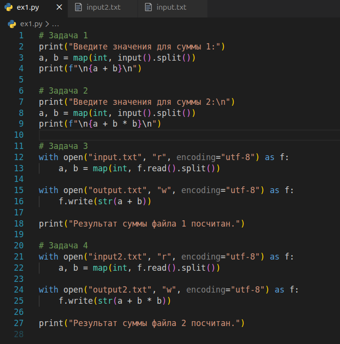
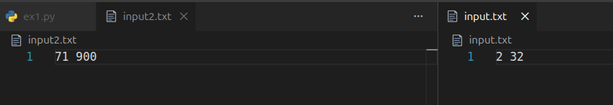
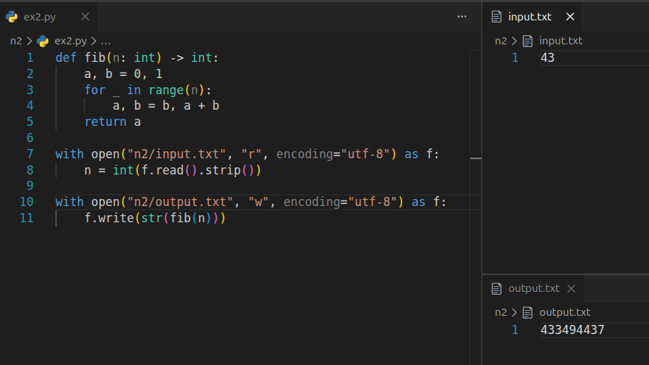
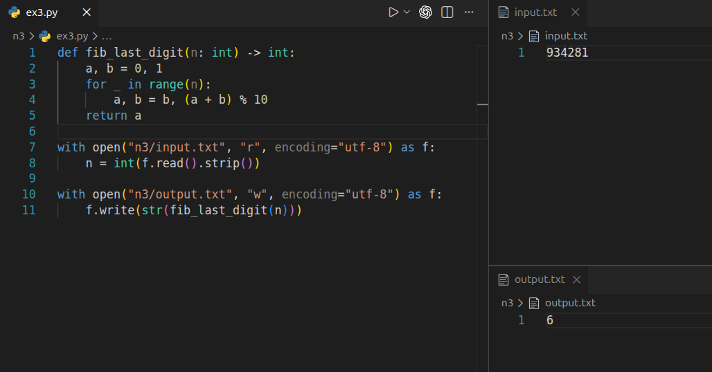

# Лабораторная работа 0 - Введение

## Цель
Освоить базовый ввод–вывод в Python (stdin/stdout и файлы), а также реализовать простые алгоритмы на числах Фибоначчи и оценить их время и память.

## Задания и решения

### Задание 1 - Ввод–вывод
Сделано в одном скрипте:  
1) `a + b` (stdin)  
2) `a + b^2` (stdin)  
3) `a + b` (input.txt -> output.txt)  
4) `a + b^2` (input2.txt -> output2.txt)  

- Для stdin используется `input().split()` и `map(int, ...)` - сразу разбивает по пробелу и переводит в число.



Пример входных данных (файлы):
- `input.txt`: `2 32`
- `input2.txt`: `71 900`



Пример результатов:
- `output.txt`: `34`
- `output2.txt`: `810071`


---

### Задание 2 - Число Фибоначчи Fn (0 ≤ n ≤ 45, файлы)
Реализация итеративная (без рекурсии): на каждом шаге обновляется пара `(a, b)`:
- `a` - текущее `F(k)`
- `b` - следующее `F(k+1)`

Ключевая операция:
- `a, b = b, a + b`

Сложность:
- Время: O(n)
- Память: O(1)

Пример: `n = 43`, результат 433494437.



---

### Задание 3 - Последняя цифра Fn (0 ≤ n ≤ 10^7, файлы)
Чтобы не хранить большие числа, на каждом шаге берётся остаток по модулю 10:
- `a, b = b, (a + b) % 10`

Это сохраняет только последнюю цифру, что сильно ускоряет вычисления и экономит память.

Сложность:
- Время: O(n)
- Память: O(1)

Пример (из скриншота): `n = 934281`, ответ `6`.



---

### Задание 4 - Измерение времени и памяти
Сделан отдельный скрипт бенчмарка:
- Время меряется через `time.perf_counter()` и берётся лучший результат из нескольких прогонов (`repeats=5`).
- Память меряется через `tracemalloc`, выводится пиковое значение (`peak`).

```python
import time
import tracemalloc

def fib(n: int) -> int:
    a, b = 0, 1
    for _ in range(n):
        a, b = b, a + b
    return a

def fib_last_digit(n: int) -> int:
    a, b = 0, 1
    for _ in range(n):
        a, b = b, (a + b) % 10
    return a

def timer(fn, n: int, repeats: int = 5) -> float:
    best = float("inf")
    for _ in range(repeats):
        t0 = time.perf_counter()
        fn(n)
        t1 = time.perf_counter()
        best = min(best, t1 - t0)
    return best

def memory_counter(fn, n: int):
    tracemalloc.start()
    fn(n)
    current, peak = tracemalloc.get_traced_memory()
    tracemalloc.stop()
    return current, peak

if __name__ == "__main__":
    print("Время (сек)")
    for n in [0, 1, 5, 10, 20, 45]:
        print(f"fib({n}) = {timer(fib, n):.6f}")

    for n in [10, 1000, 100_000, 1_000_000, 10_000_000]:
        print(f"last_digit_linear({n}) = {timer(fib_last_digit, n):.6f}")

    print("\nПамять")
    cur, peak = memory_counter(fib_last_digit, 1_000_000)
    print(f"пиковая загруженность в байтах = {peak}")

```

Замеры проводятся на наборах `n`:
- Для `fib(n)` – небольшие n (до 45).
- Для `fib_last_digit(n)` – большие n (до 10^7).

## Вывод
Реализованы базовые операции ввода–вывода (stdin/stdout и файлы), итеративный алгоритм Фибоначчи и вычисление последней цифры через `% 10`, а также выполнены замеры времени и памяти для сравнения решений.