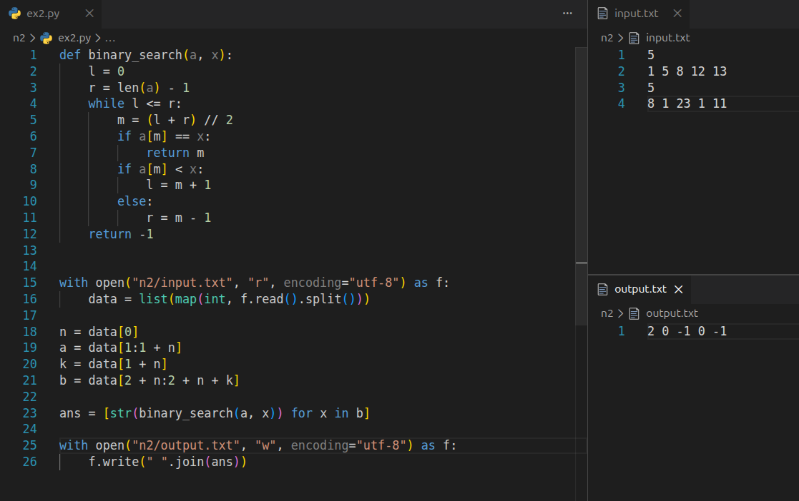

# Лабораторная работа 2 - Сортировка слиянием, бинарный поиск, поиск максимального подмассива

## Цель

Демонстрация метода «Разделяй и властвуй» на примере сортировки слиянием, а также реализация бинарного поиска и алгоритма поиска максимальной суммы подмассива.

## Задание 1 - Сортировка слиянием

В лекции 2 дан псевдокод `Merge` и `Merge-Sort`. Я сделал 2 версии:

1. Версия 1 - по лекции, как в псевдокоде: `merge` использует сигнальные значения (INF), сортировка работает по границам `left, mid, right` и меняет массив.
2. Версия 2 - переделанная под пункт 3: сигнальные значения не используются (и без индексов `p,q,r`), `merge_sort` работает на списках и возвращает новый отсортированный список.

Ниже оба варианта кода:

### Вариант 1 - по лекции

```python
# ex1_1.py - вариант по лекции

INF = 10**19

def merge(A, left, mid, right):
    # сливаем A[left:mid+1] и A[mid+1:right+1]
    n1 = mid - left + 1
    n2 = right - mid

    L = [0] * (n1 + 1)
    R = [0] * (n2 + 1)

    for i in range(n1):
        L[i] = A[left + i]
    for j in range(n2):
        R[j] = A[mid + 1 + j]

    L[n1] = INF
    R[n2] = INF

    i = 0
    j = 0
    for k in range(left, right + 1):
        if L[i] <= R[j]:
            A[k] = L[i]
            i += 1
        else:
            A[k] = R[j]
            j += 1


def merge_sort(A, left, right):
    if left < right:
        mid = (left + right) // 2
        merge_sort(A, left, mid)
        merge_sort(A, mid + 1, right)
        merge(A, left, mid, right)


with open("n1/input_worst.txt", "r", encoding="utf-8") as f:
    n = int(f.readline())
    A = list(map(int, f.readline().split()))

merge_sort(A, 0, n - 1)

with open("n1/output.txt", "w", encoding="utf-8") as f:
    f.write(" ".join(map(str, A)))
```

### Вариант 2

```python
# ex1_2.py - вариант без сигнальных значений и индексов

def merge(left, right):
    i = 0
    j = 0
    res = []

    while i < len(left) and j < len(right):
        if left[i] <= right[j]:
            res.append(left[i])
            i += 1
        else:
            res.append(right[j])
            j += 1

    res.extend(left[i:])
    res.extend(right[j:])
    return res


def merge_sort(a):
    if len(a) <= 1:
        return a
    mid = len(a) // 2
    left = merge_sort(a[:mid])
    right = merge_sort(a[mid:])
    return merge(left, right)


with open("n1/input_worst.txt", "r", encoding="utf-8") as f:
    n = int(f.readline())
    a = list(map(int, f.readline().split()))

sorted_a = merge_sort(a)

with open("n1/output2.txt", "w", encoding="utf-8") as f:
    f.write(" ".join(map(str, sorted_a)))
```

### Генератор тестов для задания 1

Для проверки я использовал генератор входных данных, который создает 3 случая:

* лучший - уже отсортированный массив
* средний - случайная перестановка
* худший - массив в обратном порядке

```python
# rangen.py - генератор входных данных для сортировки

import random

random.seed("chikirao")

def write_case(filename, a):
    with open(filename, "w", encoding="utf-8") as f:
        f.write(str(len(a)) + "\n")
        f.write(" ".join(map(str, a)) + "\n")

n = 10000
a_best = list(range(n)) # уже отсортирован
a_worst = list(range(n, 0, -1)) # обратный порядок
a_avg = list(range(n))
random.shuffle(a_avg) # случайный

write_case("n1/input_best.txt", a_best)
write_case("n1/input_avg.txt", a_avg)
write_case("n1/input_worst.txt", a_worst)
```

Сложность сортировки слиянием - `O(n * log n)`. Оба варианта дают корректный отсортированный массив. Вариант 2 дополнительно выполняет требование пункта 3.

---

## Задание 2 - Бинарный поиск

В этой задаче требуется для каждого числа `b[j]` найти индекс в отсортированном массиве `a`, либо вывести `-1`, если числа нет. Используется классический алгоритм бинарного поиска со сложностью `O(log n)`.



Сложность обработки всех `k` запросов - `O(k * log n)`. Память - `O(1)`.

---

## Задание 3 - Поиск максимального подмассива

Необходимо найти максимальную сумму элементов среди всех непрерывных подмассивов данного массива. Решение по аналогии с merge-sort.

Формат входа: `n` и `n` чисел. На выходе - одно число `ans`.

```python
def find_max_crossing_subarray(A, low, mid, high):

    left_sum = -10**30
    s = 0
    max_left = mid
    for i in range(mid, low - 1, -1):
        s += A[i]
        if s > left_sum:
            left_sum = s
            max_left = i

    right_sum = -10**30
    s = 0
    max_right = mid + 1
    for j in range(mid + 1, high + 1):
        s += A[j]
        if s > right_sum:
            right_sum = s
            max_right = j

    return max_left, max_right, left_sum + right_sum


def find_maximum_subarray(A, low, high):
    if high == low:
        return low, high, A[low]

    mid = (low + high) // 2

    left_low, left_high, left_sum = find_maximum_subarray(A, low, mid)
    right_low, right_high, right_sum = find_maximum_subarray(A, mid + 1, high)
    cross_low, cross_high, cross_sum = find_max_crossing_subarray(A, low, mid, high)

    if left_sum >= right_sum and left_sum >= cross_sum:
        return left_low, left_high, left_sum
    elif right_sum >= left_sum and right_sum >= cross_sum:
        return right_low, right_high, right_sum
    else:
        return cross_low, cross_high, cross_sum


with open("n3/input.txt", "r", encoding="utf-8") as f:
    n = int(f.readline())
    A = list(map(int, f.readline().split()))

_, _, ans = find_maximum_subarray(A, 0, n - 1)

with open("n3/output.txt", "w", encoding="utf-8") as f:
    f.write(str(ans))
```

Для тестирования создан генератор `rangen_ex3.py`, который формирует случайный массив длиной 10000 с числами из диапазона `[-1000, 1000]` и записывает его в `input.txt`.

```python
# rangen_ex3.py - генератор для задачи 3
import random
random.seed("chikirao")

n = 10000
low = -1000
high = 1000
a = [random.randint(low, high) for _ in range(n)]

with open("n3/input.txt", "w", encoding="utf-8") as f:
    f.write(str(n) + "\n")
    f.write(" ".join(map(str, a)) + "\n")
```

Алгоритм работает за `O(n log n)` времени и использует `O(n)` на входные данные + `O(log n)` сверху. Проверка на случайных данных подтверждает корректность результата.
